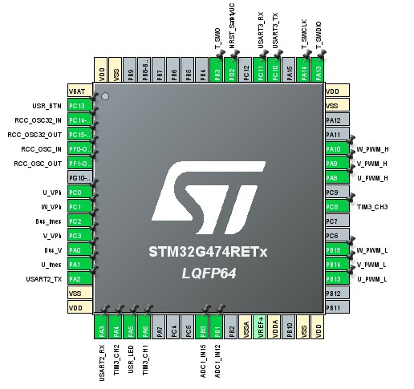
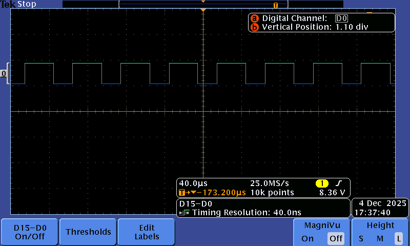
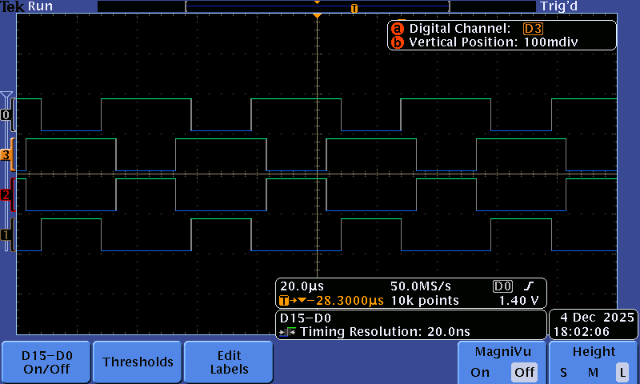
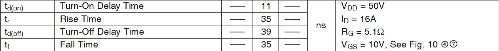
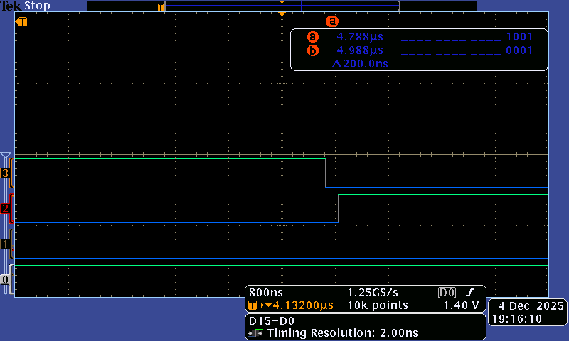
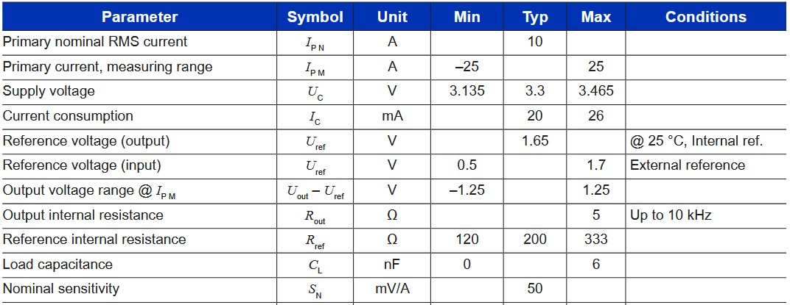

# TP_AAA_Bonnet_Terlinden

## Objectif

A partir d'un hacheur complet et d'une carte Nucleo-STM32G474RE, nous devons:

- Réaliser la commande des 4 transistors du hacheur en commande complémentaire décalée,
- Faire l'acquisition des différents capteurs,
- Réaliser l'asservissement en temps réel.

## Pinout
Voici les deux schémas de brochage utilisés pour le projet :

-   
	*Figure 1 — Pinout droit(fichier `ressource/pinout1.jpg`).*

-   
	*Figure 2 — Pinout gauche(fichier `ressource/pinout2.jpg`).*

-   
	*Figure 3 — Pinout de la chip(fichier `ressource/chippinout.jpg`).*

## Commande MCC basique

Objectifs :

- Générer 4 PWM en complémentaire décalée pour contrôler en boucle ouverte le moteur en respectant le cahier des charges,
- Inclure le temps mort,
- Vérifier les signaux de commande à l'oscilloscope,
- Prendre en main le hacheur,
- Faire un premier essai de commande moteur.

On crée deffirentes pwm d'une fréquence de 20kHz:

-   
	*Figure 4 — Visualisation d'une pwm sur TIM_CHANNEL_1 à 60%(fichier `ressource/sonde1signal.png`).*

-   
	*Figure 4 — Visualisation d'une pwm sur TIM_CHANNEL_1 et de sa complémentaire TIM_CHANNEL_1N à 60%(fichier `ressource/sonde2signal.png`).*

-   
	*Figure 4 — Visualisation de 4 pwm à 60%(fichier `ressource/sonde4signal.png`).*

Il faut encore ajouter le temps mort entre les signaux complémentaires. On trouve dans la data sheet du driver de gate IRF540N:
-   
    *Figure 5 — Timing IRF540N(fichier `ressource/timeout_IRF540.jpg`).*

On peut seléctionner dans CubeMX dans les paramètres avancés du timer le temps mort à ajouter (120 ns minimum). On choisit 200ns ce qui corespond à 34 ticks du timer à 170MHz.

-   
    *Figure 5 — deadtime de 200ns à l'oscilloscope(fichier `ressource/deadtime.png`).*

Voici le code de notre fonction de commande moteur:

```c
int motor_control(h_shell_t* h_shell, int argc, char** argv)
{
	int size;

	//Sécurité
	if (argc < 2) {
		size = snprintf(h_shell->print_buffer, SHELL_PRINT_BUFFER_SIZE, "Erreur: Entrez un rapport (0-100)\r\n");
		h_shell->drv.transmit(h_shell->print_buffer, size);
		return -1;
	}
	int alpha_input = atoi(argv[1]);

	//Clamping

	if (alpha_input > 100) {
		size = snprintf(h_shell->print_buffer, SHELL_PRINT_BUFFER_SIZE, "Erreur: Entrez un rapport (0-100)\r\n");
		h_shell->drv.transmit(h_shell->print_buffer, size);
		return -1;
	}
	if (alpha_input < 0) {
		size = snprintf(h_shell->print_buffer, SHELL_PRINT_BUFFER_SIZE, "Erreur: Entrez un rapport (0-100)\r\n");
		h_shell->drv.transmit(h_shell->print_buffer, size);
		return -1;
	}


	uint32_t pulse_ch1 = (alpha_input * ARR) / 100;
	uint32_t pulse_ch2 = ((100 - alpha_input) * ARR) / 100;

	HAL_TIM_PWM_Start(&htim1, TIM_CHANNEL_1);
	HAL_TIMEx_PWMN_Start(&htim1, TIM_CHANNEL_1);

	HAL_TIM_PWM_Start(&htim1, TIM_CHANNEL_2);
	HAL_TIMEx_PWMN_Start(&htim1, TIM_CHANNEL_2);


	__HAL_TIM_SET_COMPARE(&htim1, TIM_CHANNEL_1, pulse_ch1);
	__HAL_TIM_SET_COMPARE(&htim1, TIM_CHANNEL_2, pulse_ch2);

	size = snprintf(h_shell->print_buffer, SHELL_PRINT_BUFFER_SIZE,
			"PWM Set: CH1=%d%% (%lu), CH2=%d%% (%lu)\r\n",
			alpha_input, pulse_ch1, (100-alpha_input), pulse_ch2);
	h_shell->drv.transmit(h_shell->print_buffer, size);

	return 0;
}
```

On fait quelques tests sur le shell:
```
=> Monsieur Shell v0.2.2 without FreeRTOS <=
MSC@SAC-TP:/motor 50
PWM Set: CH1=50% (2125), CH2=50% (2125)
MSC@SAC-TP:/motor 120
Erreur: Entrez un rapport (0-100)
MSC@SAC-TP:/motor 0
PWM Set: CH1=0% (0), CH2=100% (4250)
MSC@SAC-TP:/motor 10
PWM Set: CH1=10% (425), CH2=90% (3825)
MSC@SAC-TP:/motor 1293849309844
Erreur: Entrez un rapport (0-100)
```

On intègre ensuite des commande start et stop pour démarrer et arrêter les PWM:

```
MSC@SAC-TP:/start
Moteur démarré : PWM CH1/CH2 initialisé à 50%.
MSC@SAC-TP:/stop
Moteur arrêté : PWM CH1/CH2 stoppé.
```

# Commande en boucle ouverte, mesure de Vitesse et de courant

## Mesure de courant

On utilise la pin PA1 pour la mesure de courant sur U. 
-   
	*Figure 6 — Pin de mesure de courant(fichier `ressource/pincourant.jpg`).*

On trouve dans la datasheet du capteur de courant:
-   
	*Figure 7 — Datasheet du capteur de courant(fichier `ressource/datasheetcapteur.jpg`).*
La fonction de lecture du courant est la suivante:
\[
U_{\text{out}}(I_{mes}) \approx 1.65\,\text{V} + 0.05\,\text{V/A} \cdot I_{mes}
\]
Donc on en déduit:
\[
I_{mes} \approx \frac{U_{\text{out}} - 1.65\,\text{V}}{0.05\,\text{V/A}}
\]

On doit réaliser une fonction de calibration de l'adc pour mesurer le courant. Pour cela on réalise une moyenne de 100 mesures pour avoir une valeur stable du offset à 0A.

```c
float calibrate_current_zero(void)
{
    float total_u_out = 0.0f;
    uint32_t adc_raw_value;
    float u_out_volts;

    for (int i = 0; i < CALIBRATION_SAMPLES; i++)
    {
        if (HAL_ADC_Start(&hadc1) == HAL_OK)
        {
            if (HAL_ADC_PollForConversion(&hadc1, 10) == HAL_OK)
            {
                if (HAL_ADC_GetState(&hadc1) & HAL_ADC_STATE_REG_EOC)
                {
                    adc_raw_value = HAL_ADC_GetValue(&hadc1);
                    u_out_volts = ((float)adc_raw_value / ADC_MAX_VALUE) * VREF_VOLTS;
                    total_u_out += u_out_volts;
                }
            }
            HAL_ADC_Stop(&hadc1);
        }
    }
    g_calibrated_offset_volts = total_u_out / CALIBRATION_SAMPLES;
    printf("Courant de calibration : %f A\r\n", g_calibrated_offset_volts);
    return g_calibrated_offset_volts;
}
```

On réalise ensuite la fonction de lecture du courant:

```c
float read_current_polling()
{
    uint32_t adc_raw_value = 0;
    float u_out_volts = 0.0f;
    float imes_amperes = 0.0f;


    if (HAL_ADC_Start(&hadc1) != HAL_OK)
	{
		// Gerer l'erreur de demarrage
		return -999.0f;
	}

	if (HAL_ADC_PollForConversion(&hadc1, 100) != HAL_OK)
	{
		HAL_ADC_Stop(&hadc1);
		return -999.0f;
	}

    if (HAL_ADC_GetState(&hadc1) & HAL_ADC_STATE_REG_EOC)
    {
        adc_raw_value = HAL_ADC_GetValue(&hadc1);
    }

    HAL_ADC_Stop(&hadc1);

    // Uout = V_ADC * (Vref / (2^N - 1))
    u_out_volts = ((float)adc_raw_value / ADC_MAX_VALUE) * VREF_VOLTS;

    // Imes = (Uout - 1.65V) / (0.05V/A)
    imes_amperes = (u_out_volts - g_calibrated_offset_volts) / SENSITIVITY_V_PER_A;
    printf("Courant : %f A\r\n", imes_amperes);
    printf("Raw : %d \r\n", adc_raw_value);
    return imes_amperes;
}
```

On obtient:
```
=> Monsieur Shell v0.2.2 without FreeRTOS <=
MSC@SAC-TP:/Courant de calibration : 1.608070 A
Courant : 0.282545 A
Raw : 2013
Courant : 0.169725 A
Raw : 2006
Courant : 0.040789 A
Raw : 1998
Courant : 0.234194 A
Raw : 2010
Courant : -0.152619 A
Raw : 1986
Courant : -0.168736 A
Raw : 1985
Courant : 0.185843 A
Raw : 2007
```
